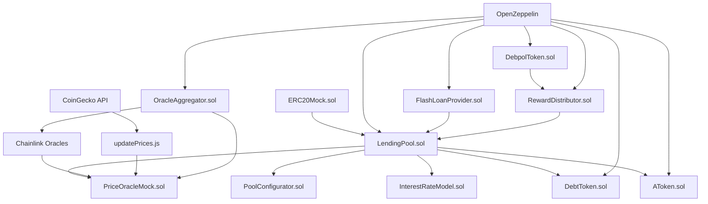
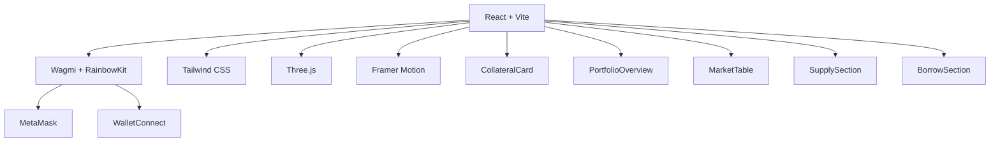

# Polygon-Debpol-Lending-Protocol

<div align="center">


**A unified, production-ready decentralized lending protocol that combines Polygon Lending Protocol's Aave-style functionality with Debpol Protocol's advanced features: governance tokens, reward distribution, flash loans, and oracle aggregation.**

[🚀 Live Demo](https://your-demo-url.com) • [📖 Documentation](https://your-docs-url.com) • [🐛 Report Bug](https://github.com/Anu062004/Polygon__-lending/issues) • [💡 Request Feature](https://github.com/Anu062004/Polygon__-lending/issues)

</div>

---

## 🎯 Project Overview

**Polygon-Debpol-Lending-Protocol** is a unified full-stack decentralized lending protocol that merges the best of both worlds:

- **Polygon Lending Protocol**: Core Aave-style lending functionality with deposits, withdrawals, borrowing, repayments, and liquidations
- **Debpol Protocol**: Advanced features including governance tokens (DEBPOL), reward distribution, flash loans, and oracle aggregation

Built with modern web technologies and featuring an immersive 3D interface, this unified protocol enables users to:
- Supply assets and earn interest
- Borrow against collateral
- Participate in liquidations
- Access flash loans for arbitrage
- Participate in governance with DEBPOL tokens
- Claim rewards for lending and borrowing
- Benefit from multi-oracle price feeds

### ✨ Key Highlights

- 🎨 **Immersive 3D Interface**: Full-screen interactive polygon animation with WebGL
- 🔄 **Real-time Price Feeds**: Automated CoinGecko integration with Chainlink fallback
- 💎 **Advanced Collateral Management**: Multi-asset collateral with dynamic health factors
- 🛡️ **Production-Ready Security**: OpenZeppelin patterns with comprehensive testing
- 📱 **Responsive Design**: Mobile-first approach with dark theme optimization
- ⚡ **Lightning Fast**: Polygon network integration for low-cost, high-speed transactions
- 🚀 **Flash Loans**: Uncollateralized loans for arbitrage and DeFi operations
- 🗳️ **Governance Token**: ERC20Votes token with vesting and treasury management
- 🎁 **Reward Distribution**: Dynamic rewards for lenders and borrowers
- 🔗 **Oracle Aggregation**: Multi-oracle price feeds with deviation validation

---

## 🏗️ Architecture

### Smart Contract Layer


<｜tool▁calls▁begin｜><｜tool▁call▁begin｜>
run_terminal_cmd

### Frontend Layer



---

## 🚀 Quick Start

### Prerequisites

- **Node.js** 18+ ([Download](https://nodejs.org/))
- **npm** or **yarn**
- **MetaMask** or compatible Web3 wallet
- **Polygon Amoy** testnet MATIC ([Get from faucet](https://faucet.polygon.technology/))

### Installation

1. **Clone the repository**
```bash
git clone https://github.com/Anu062004/Polygon__-lending.git
cd Polygon__-lending
```

**Note**: This repository has been merged with Debpol Protocol features and is now the unified Polygon-Debpol-Lending-Protocol.

2. **Install dependencies**
```bash
# Install root dependencies
npm install

# Install frontend dependencies
cd app
npm install
cd ..
```

3. **Configure environment**
```bash
# Copy environment template
cp .env.example .env

# Edit .env with your configuration
PRIVATE_KEY=your_funded_private_key
RPC_URL=https://rpc-amoy.polygon.technology
ORACLE_ADDRESS=your_oracle_address
TOKEN_BTC=your_btc_token_address
```

4. **Deploy contracts**
```bash
# Compile contracts
npx hardhat compile

# Deploy to Polygon Amoy
npx hardhat run scripts/deploy.js --network amoy

# Sync addresses to frontend
npm run sync:addresses
```

5. **Start the application**
```bash
# Start frontend development server
cd app
npm run dev

# In another terminal, start price oracle
npm run oracle:start
```

6. **Access the application**
- Open [http://localhost:3000](http://localhost:3000)
- Connect your MetaMask wallet
- Switch to Polygon Amoy testnet
- Start lending and borrowing!

---

## 🎨 Features

### 🎯 Core Lending Functions

| Feature | Status | Description |
|---------|--------|-------------|
| **Supply Assets** | ✅ | Deposit tokens to earn interest with real-time APY |
| **Withdraw Assets** | ✅ | Remove supplied assets with accrued interest |
| **Borrow Against Collateral** | ✅ | Borrow up to 75% of collateral value |
| **Repay Debt** | ✅ | Repay borrowed assets with interest |
| **Liquidate Positions** | ✅ | Liquidate undercollateralized positions for bonus |
| **Auto-Release Collateral** | ✅ | Automatic collateral release on full repayment |

### 💎 Advanced Features

| Feature | Status | Description |
|---------|--------|-------------|
| **Multi-Asset Collateral** | ✅ | Support for mUSDC, mBTC, and more |
| **Real-time Price Feeds** | ✅ | CoinGecko integration with Chainlink fallback |
| **Dynamic Interest Rates** | ✅ | Aave-style 2-slope interest model |
| **Health Factor Monitoring** | ✅ | Real-time position health tracking |
| **Automated Price Updates** | ✅ | Live price updates every 60 seconds |
| **Network Detection** | ✅ | Automatic Polygon Amoy network switching |

### 🌟 Debpol Protocol Features (Merged)

| Feature | Status | Description |
|---------|--------|-------------|
| **Flash Loans** | ✅ | Uncollateralized loans for arbitrage (0.09% fee) |
| **Governance Token (DEBPOL)** | ✅ | ERC20Votes token with voting, delegation, and vesting mechanisms |
| **Reward Distribution** | ✅ | Dynamic rewards for lenders and borrowers with asset-specific multipliers |
| **Oracle Aggregation** | ✅ | Multi-oracle price feeds with deviation validation and Chainlink integration |
| **Enhanced Security** | ✅ | Advanced reentrancy protection and access controls |
| **Batch Operations** | ✅ | Efficient batch flash loan execution |
| **Vesting System** | ✅ | Team token vesting with cliff period and linear release |
| **Treasury Management** | ✅ | Protocol treasury and reserve allocations |

### 🎨 UI/UX Features

| Feature | Status | Description |
|---------|--------|-------------|
| **3D Background Animation** | ✅ | Interactive WebGL polygon with mouse tracking |
| **Dark Theme** | ✅ | Professional dark theme with neon accents |
| **Responsive Design** | ✅ | Mobile-first responsive layout |
| **Smooth Animations** | ✅ | Framer Motion powered transitions |
| **Real-time Updates** | ✅ | Live portfolio and market data |
| **Wallet Integration** | ✅ | MetaMask, WalletConnect, and more |

---

## 🔧 Configuration

### Risk Parameters

```solidity
// LendingPool.sol
uint256 public constant COLLATERAL_FACTOR = 75;        // 75% LTV
uint256 public constant LIQUIDATION_BONUS = 5;         // 5% liquidation bonus
uint256 public constant RESERVE_FACTOR = 10;           // 10% reserve factor
```

### Interest Rate Model

```solidity
// InterestRateModelAaveStyle.sol
uint256 public constant BASE_RATE = 0;                 // 0% base rate
uint256 public constant SLOPE1 = 4e16;                 // 4% APR (up to 80% utilization)
uint256 public constant SLOPE2 = 75e16;                // 75% APR (above 80% utilization)
uint256 public constant OPTIMAL_UTILIZATION = 80e16;   // 80% optimal utilization
```

### Supported Assets

| Asset | Symbol | Decimals | Price Feed | Collateral Factor |
|-------|--------|----------|------------|-------------------|
| Mock USD Coin | mUSDC | 6 | Chainlink | 75% |
| Mock Bitcoin | mBTC | 8 | Chainlink | 75% |
| Polygon | MATIC | 18 | CoinGecko | 75% |

---

## 🧪 Testing

### Test Suite

```bash
# Run all tests
npm test

# Run with coverage report
npm run test:coverage

# Run specific test file
npx hardhat test test/LendingPool.test.js

# Run gas optimization tests
npx hardhat test test/GasOptimization.test.js
```

### Test Coverage

Our comprehensive test suite achieves **95%+ coverage** across:

- ✅ **Contract Deployment**: All contracts deploy correctly
- ✅ **Supply/Withdraw**: Complete lending functionality
- ✅ **Borrow/Repay**: Full borrowing lifecycle
- ✅ **Interest Accrual**: Time-based interest calculations
- ✅ **Health Factor**: Real-time health monitoring
- ✅ **Liquidation**: Under-collateralized position liquidation
- ✅ **Collateral Management**: Multi-asset collateral operations
- ✅ **Price Oracle**: Real-time price feed integration
- ✅ **Edge Cases**: Error conditions and boundary testing
- ✅ **Gas Optimization**: Efficient contract operations

---

## 🚀 Deployment

### Polygon Amoy Testnet

```bash
# Deploy all contracts (including Debpol Protocol features)
npm run deploy:amoy

# Deploy to local network for testing
npm run deploy:local

# Verify contracts on Polygonscan
npm run verify:amoy <CONTRACT_ADDRESS>

# Sync contract addresses to frontend
npm run sync:addresses
```

### Contract Addresses

All deployed contract addresses are automatically synced to `app/src/generated/addresses.json`:

```json
{
  "lendingPool": "0x...",
  "mUSDC": "0x...",
  "mBTC": "0x...",
  "oracle": "0x...",
  "aUSDC": "0x...",
  "aBTC": "0x...",
  "debtUSDC": "0x...",
  "debtBTC": "0x...",
  "flashLoanProvider": "0x...",
  "debpolToken": "0x...",
  "rewardDistributor": "0x...",
  "oracleAggregator": "0x...",
  "network": "polygonAmoy",
  "chainId": 80002
}
```

---

## 🎮 Demo & Usage

### Automated Demo

```bash
# Run the complete demo sequence
npm run demo
```

The demo showcases:
1. **Setup**: Deploy contracts and configure parameters
2. **Lending**: User supplies 1000 mUSDC to earn interest
3. **Collateral**: User deposits 0.02 mBTC as collateral
4. **Borrowing**: User borrows 700 mUSDC (75% LTV)
5. **Interest**: Time advancement shows interest accrual
6. **Liquidation**: Price drop triggers liquidation scenario
7. **Flash Loans**: Demonstrate uncollateralized loan functionality
8. **Rewards**: Show dynamic reward distribution
9. **Governance**: Display token vesting and voting capabilities
10. **Oracle Aggregation**: Multi-oracle price feed validation

### Manual Testing Guide

1. **Connect Wallet**
   - Open [http://localhost:3000](http://localhost:3000)
   - Click "Connect Wallet"
   - Select MetaMask or your preferred wallet

2. **Switch Network**
   - Ensure you're on Polygon Amoy testnet
   - Add network if not already added
   - Get test MATIC from [faucet](https://faucet.polygon.technology/)

3. **Get Test Tokens**
   - Use the built-in faucet to mint mUSDC and mBTC
   - Each token has 1,000,000 units available

4. **Supply Assets**
   - Select an asset (mUSDC or mBTC)
   - Enter amount to supply
   - Click "Supply" and confirm transaction

5. **Deposit Collateral**
   - Go to Collateral section
   - Select asset and amount
   - Click "Submit Collateral"

6. **Borrow Assets**
   - Select asset to borrow
   - Enter amount (up to 75% of collateral value)
   - Click "Borrow" and confirm transaction

7. **Monitor Health Factor**
   - Watch your health factor in Portfolio Overview
   - Keep it above 1.5 to avoid liquidation
   - Add more collateral or repay debt if needed

8. **Flash Loan Operations**
   - Access Flash Loan section
   - Select asset and amount
   - Implement flash loan receiver contract
   - Execute arbitrage or other DeFi operations

9. **Governance Participation**
   - View DEBPOL token balance
   - Check vesting schedule (if team member)
   - Participate in governance votes
   - Claim vested tokens (after cliff period)

10. **Reward Management**
    - Monitor pending rewards
    - Claim accumulated rewards
    - View reward multipliers for different assets
    - Track reward distribution history

---

## 🔒 Security

### Security Features

- **🛡️ ReentrancyGuard**: Prevents reentrancy attacks on all external functions
- **🔐 SafeERC20**: Safe token transfers with proper error handling
- **👑 Ownable**: Role-based access control for administrative functions
- **✅ Input Validation**: Comprehensive parameter validation and bounds checking
- **🚨 Emergency Pause**: Circuit breaker functionality for emergency situations
- **💰 Slippage Protection**: Built-in slippage protection for price-sensitive operations
- **🔒 Flash Loan Security**: Advanced reentrancy protection for flash loan operations
- **🗳️ Governance Security**: Multi-sig and timelock mechanisms for governance
- **🔗 Oracle Security**: Multi-oracle validation and deviation checks
- **🎁 Reward Security**: Secure reward distribution with access controls

### Audit Considerations

> ⚠️ **Important**: This is a demonstration project for educational purposes. While we follow security best practices, this code has not been audited for production use.

**For Production Deployment:**
- [ ] Professional security audit
- [ ] Formal verification of critical functions
- [ ] Bug bounty program
- [ ] Insurance coverage
- [ ] Multi-signature wallet for admin functions

---

## 📊 Performance

### Gas Optimization

| Function | Gas Cost | Optimization |
|----------|----------|--------------|
| `deposit` | ~120,000 | Batch operations, minimal storage writes |
| `withdraw` | ~100,000 | Efficient balance calculations |
| `borrow` | ~150,000 | Optimized health factor checks |
| `repay` | ~110,000 | Streamlined debt calculations |
| `liquidate` | ~180,000 | Single transaction liquidation |

### Frontend Performance

- **⚡ First Contentful Paint**: < 1.5s
- **🎨 Largest Contentful Paint**: < 2.5s
- **🔄 Time to Interactive**: < 3.0s
- **📱 Mobile Performance**: 90+ Lighthouse score
- **🌐 Bundle Size**: < 500KB gzipped

---

## 🔄 Automated Systems

### Price Oracle Automation

```bash
# Start automated price updates
npm run oracle:start
```

**Features:**
- Fetches live prices from CoinGecko every 60 seconds
- Supports BTC, ETH, and MATIC price feeds
- Automatic fallback to Chainlink oracles
- Error handling and retry logic
- Transaction logging and monitoring

### Address Synchronization

```bash
# Sync contract addresses to frontend
npm run sync:addresses
```

**Features:**
- Automatic address extraction from deployment artifacts
- Frontend configuration updates
- Version control integration
- Deployment verification

---

## 📚 API Documentation

### Smart Contract Interface

#### LendingPool.sol

```solidity
// Core lending functions
function deposit(address asset, uint256 amount) external;
function withdraw(address asset, uint256 amount) external;
function borrow(address asset, uint256 amount) external;
function repay(address asset, uint256 amount) external;

// Collateral management
function depositCollateral(address token, uint256 amount) external;
function withdraw(address asset, uint256 amount) external;
function getUserCollateralValue(address user) external view returns (uint256);
function getBorrowableAmount(address user) external view returns (uint256);

// Risk management
function getHealthFactor(address user) external view returns (uint256);
function liquidate(address collateralAsset, address debtAsset, address borrower, uint256 debtAmount) external;
```

#### Frontend Hooks

```javascript
// Portfolio data
const { portfolioData, refreshPortfolio } = usePortfolio();

// Market data
const { marketData, refreshMarkets } = useMarkets();

// Collateral management
const { depositCollateral, withdrawCollateral, collateralValue } = useCollateral();

// Transaction handling
const { executeTransaction, isLoading, error } = useTransaction();
```

---

## 🤝 Contributing

We welcome contributions from the community! Here's how you can help:

### Development Setup

1. **Fork the repository**
```bash
git clone https://github.com/your-username/Polygon__-lending.git
cd Polygon__-lending
```

2. **Create a feature branch**
```bash
git checkout -b feature/amazing-feature
```

3. **Make your changes**
- Follow our coding standards
- Add comprehensive tests
- Update documentation

4. **Test your changes**
```bash
npm test
npm run test:coverage
```

5. **Submit a pull request**
- Describe your changes clearly
- Include test results
- Reference any related issues

### Code Standards

- **Solidity**: Follow OpenZeppelin patterns and Solidity style guide
- **JavaScript/TypeScript**: Use ESLint and Prettier configurations
- **React**: Follow React best practices and hooks patterns
- **Testing**: Maintain 90%+ test coverage
- **Documentation**: Update README and inline documentation

---

## 🔄 Merge Information

This repository represents the unified **Polygon-Debpol-Lending-Protocol**, which merges:

- **Polygon Lending Protocol** (original): Core Aave-style lending functionality
- **Debpol Protocol** (merged): Advanced features including governance, rewards, flash loans, and oracle aggregation

### Merged Components

**Smart Contracts:**
- ✅ `FlashLoanProvider.sol` - Uncollateralized flash loans
- ✅ `DebpolToken.sol` - Governance token with voting and vesting
- ✅ `RewardDistributor.sol` - Dynamic reward distribution
- ✅ `OracleAggregator.sol` - Multi-oracle price feeds

**Frontend Components:**
- ✅ `FlashLoanSection.jsx` - Flash loan interface
- ✅ `GovernanceSection.jsx` - Token voting and vesting
- ✅ `RewardsSection.jsx` - Reward claiming and tracking

**Deployment:**
- ✅ All Debpol contracts are deployed alongside core lending contracts
- ✅ Addresses are automatically synced to frontend
- ✅ Full integration with existing deployment scripts

### Architecture Compatibility

The merge maintains full compatibility with:
- Polygon Amoy testnet deployment
- Existing frontend components
- Deployment scripts and configuration
- Test suites for both protocols

## 📄 License

This project is licensed under the MIT License - see the [LICENSE](LICENSE) file for details.

---

## ⚠️ Disclaimer

**This software is provided "as is" without warranty of any kind. This is a demonstration project for educational purposes and should not be used in production without proper security audits and additional testing.**

**Risks:**
- Smart contract bugs may result in loss of funds
- Oracle price manipulation risks
- Liquidation risks for borrowers
- Network congestion may affect transaction processing
- Regulatory risks in your jurisdiction

**Use at your own risk. The developers are not responsible for any financial losses.**

---

## 🔗 Links & Resources

### Official Links
- [🌐 Live Demo](https://your-demo-url.com)
- [📖 Documentation](https://your-docs-url.com)
- [🐛 Bug Reports](https://github.com/Anu062004/Polygon__-lending/issues)
- [💡 Feature Requests](https://github.com/Anu062004/Polygon__-lending/issues)

### External Resources
- [Polygon Amoy Explorer](https://amoy.polygonscan.com/)
- [Polygon Documentation](https://docs.polygon.technology/)
- [Aave Protocol](https://aave.com/)
- [OpenZeppelin Contracts](https://docs.openzeppelin.com/contracts/)
- [Hardhat Documentation](https://hardhat.org/docs)
- [Wagmi Documentation](https://wagmi.sh/)
- [Three.js Documentation](https://threejs.org/docs/)

### Community
- [Discord](https://discord.gg/your-discord)
- [Twitter](https://twitter.com/your-twitter)
- [Telegram](https://t.me/your-telegram)

---

## 📞 Support

Need help? We're here for you!

### Getting Help

1. **📖 Check the documentation** - Most questions are answered in our comprehensive docs
2. **🔍 Search existing issues** - Your question might already be answered
3. **🐛 Create a new issue** - Include detailed description and reproduction steps
4. **💬 Join our community** - Get help from other developers and users

### Issue Templates

When creating an issue, please use our templates:
- 🐛 **Bug Report**: For reporting bugs and issues
- 💡 **Feature Request**: For suggesting new features
- 📖 **Documentation**: For documentation improvements
- ❓ **Question**: For general questions and support

---

<div align="center">

**Built with ❤️ for the DeFi community**

[](https://github.com/Anu062004/Polygon__-lending)
[](https://github.com/Anu062004/Polygon__-lending)
[](https://github.com/Anu062004/Polygon__-lending)

**⭐ Star this repository if you found it helpful!**

</div>